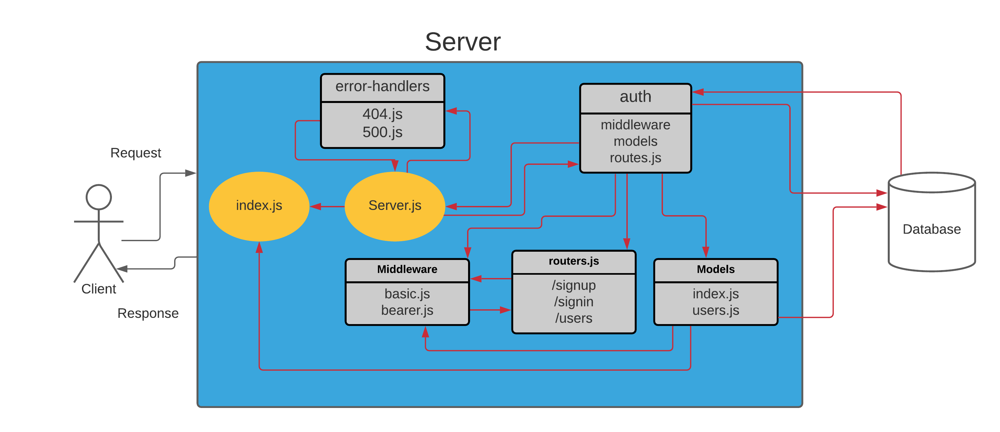

# bearer-auth

- auth-server is able to allow a user to create an account as well as to handle Basic Authentication (user provides a username + password). When a “good” login happens, the user is considered to be “authenticated” and our auth-server generates a JWT signed “Token” which is returned to the application.

---

## How to Build?

1. Create a new repo and go to action then select node.js workflow for CI.

2. Clone it to your local machine and create Package.json and add server.js and index.js.

3. Install the backages.

4. follow the design pattern in the repo and write your own code.

**important note ❗**: You should follow the structure for testing purposes and best practices.

---

## Links

[Main branch deployed on heroku](https://wesam-bearer-auth.herokuapp.com/)

[Pull request from dev branch to main](https://github.com/Wesam-Alqawasmeh/bearer-auth/pull/1)

[GitHub actions](https://github.com/Wesam-Alqawasmeh/bearer-auth/actions)

--- 

## UML

